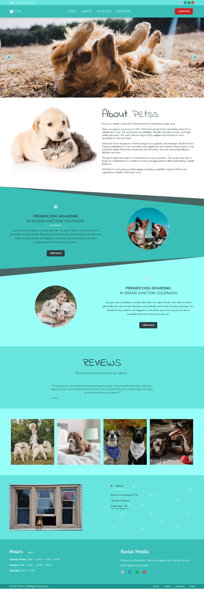

# petss

  

 Site feito 100% por mim para treinar e revisar o HTML, CSS e o JavaScript e também para aplicar alguns aprendizados sobre design e coisas do tipo.
 
 O site é para ser um suposto lugar para tosar e dar banhos em cachorros, com o principal foco de fazer com que a pessoa que encontre o site entre em contato para agendar alguns dos serviços disponíveis ou tirar sua dúvidas.
 
 Esse site foi o primeiro em que eu usei o figma pra criar do design, pesquisei outros sites no mesmo ramo e criei esse com as coisas que eu achei mais interessantes!
 Por enquanto só tem a front page, talvez mais pra frente eu desenvolva as outras páginas!
 Tentei criar tudo do zero pensando no passo a passo de como fazer cada coisa para forçar minha lógica, mas no fim eu consultei alguns projetos antigos e projetos de outras pessoas para ver realmente qual era a melhor forma de fazer!
 
 ## Ferramentas
 
 No projeto foi utilizado:

 - HTML5
 - CSS3
 - JS
